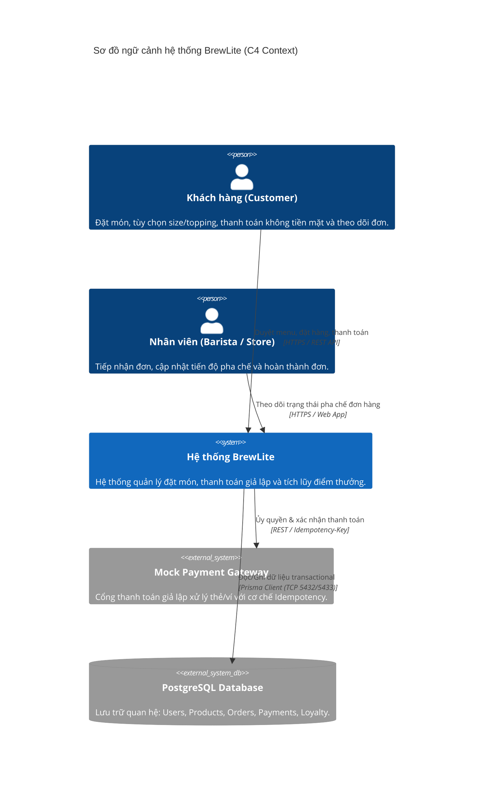
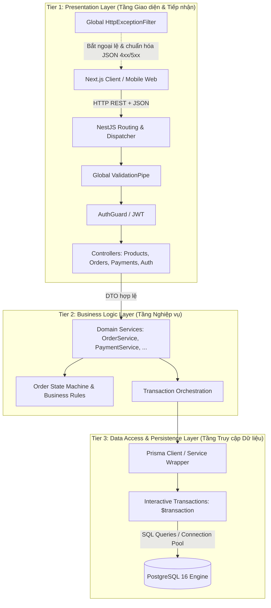
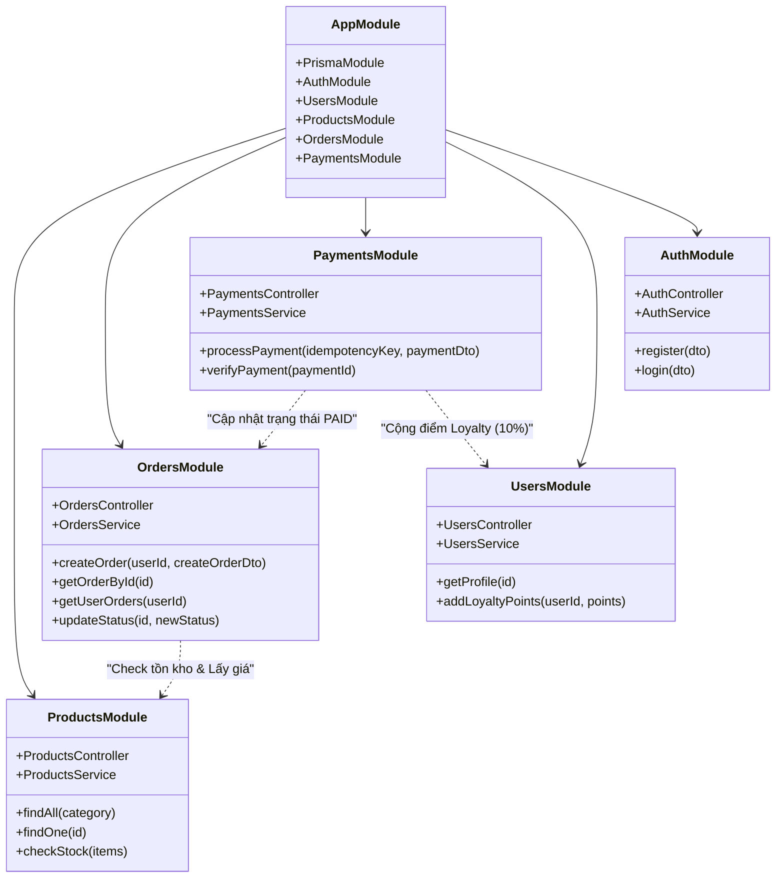
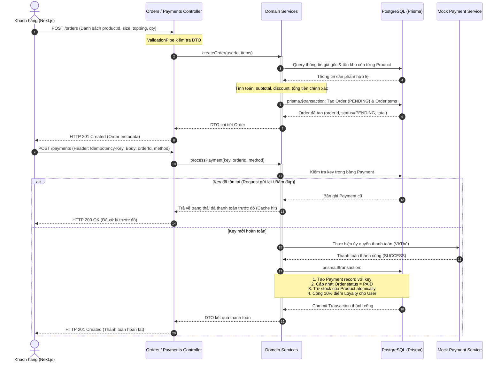
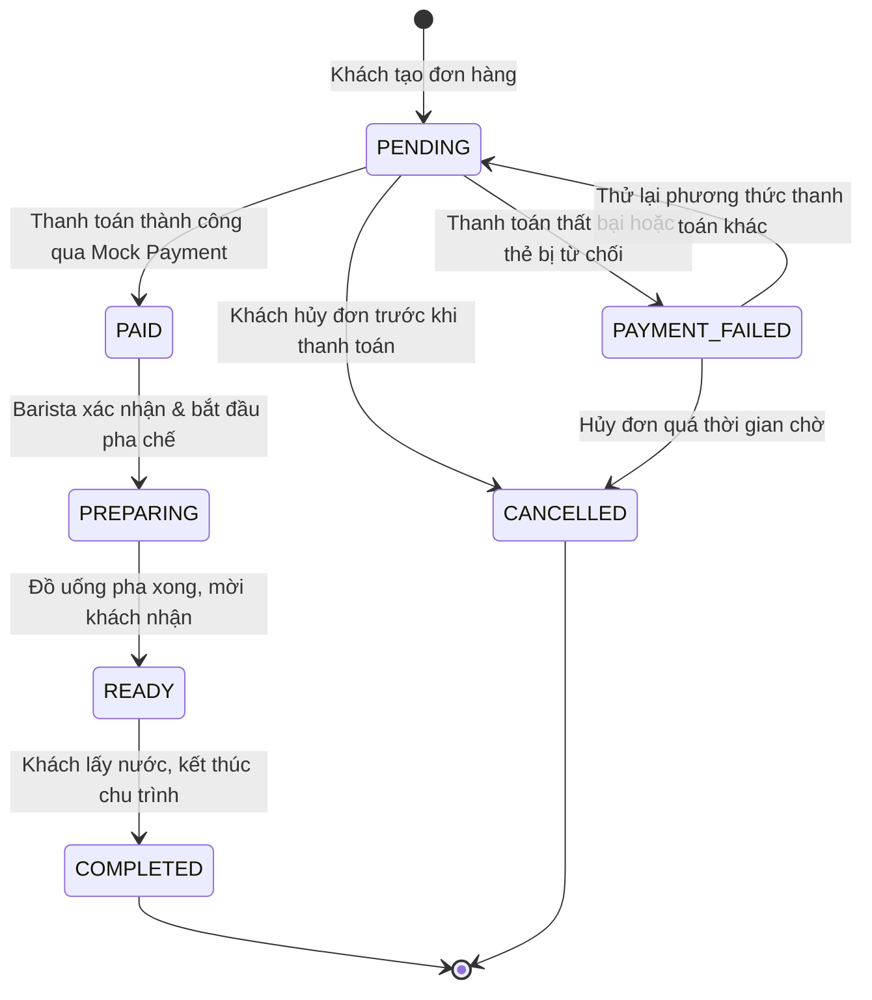

# Tài liệu Thiết kế Kiến trúc Hệ thống – BrewLite (v1.0)

> **Mã công việc:** Task A.1 (PB-14) – Sprint 1  
> **Người thực hiện:** M2 (Software Architect / Tech Lead)  
> **Dự án:** BrewLite – Hệ thống đặt cà phê không tiền mặt (Cashless Coffee Ordering System)  
> **Phiên bản:** 1.0.0 (Baseline Architecture)  
> **Hệ quản trị CSDL mục tiêu:** PostgreSQL 16+ (Docker Dev / Neon.tech)  
> **Công nghệ nền tảng:** NestJS (Backend), Next.js App Router (Frontend), Prisma ORM

---

## 1. Tổng quan hệ thống (System Overview & Context)

### 1.1. Bối cảnh nghiệp vụ

BrewLite là giải pháp đặt cà phê trực tuyến tinh gọn dành cho chuỗi cửa hàng F&B, tập trung vào trải nghiệm đặt hàng nhanh, thanh toán không dùng tiền mặt (thẻ ngân hàng, ví điện tử giả lập), cập nhật trạng thái đơn thời gian thực và tích điểm khách hàng thân thiết (Loyalty Points).

### 1.2. Sơ đồ ngữ cảnh hệ thống (C4 Context Diagram)



---

## 2. Kiến trúc 3 lớp (3-Tier Architecture Specification)

Hệ thống Backend BrewLite áp dụng kiến trúc **3 lớp (Three-Tier Layered Architecture)** chuẩn hóa trong mô hình **Modular Monolith**, đảm bảo phân tách rõ ràng trách nhiệm (Separation of Concerns - SoC) và dễ dàng kiểm thử độc lập.



### 2.1. Phân định trách nhiệm và ranh giới các tầng

| Tầng kiến trúc                   | Thành phần đảm nhiệm                           | Trách nhiệm chính                                                                                                                                                                                                                            | Ranh giới nghiêm ngặt (Boundaries)                                                                                                        |
| :------------------------------- | :--------------------------------------------- | :------------------------------------------------------------------------------------------------------------------------------------------------------------------------------------------------------------------------------------------- | :---------------------------------------------------------------------------------------------------------------------------------------- |
| **Tier 1: Presentation Layer**   | Controllers, DTOs, Pipes, Guards, Filters      | - Tiếp nhận request HTTP, parse JSON.<br>- Validate định dạng dữ liệu đầu vào qua `ValidationPipe` (`class-validator`).<br>- Xác thực quyền người dùng qua JWT `AuthGuard`.<br>- Chuẩn hóa cấu trúc phản hồi lỗi qua `HttpExceptionFilter`.  | **TUYỆT ĐỐI KHÔNG** query database trực tiếp (không inject `PrismaService`).<br>**TUYỆT ĐỐI KHÔNG** chứa logic tính tiền hoặc chiết khấu. |
| **Tier 2: Business Logic Layer** | Services, Domain Entities, State Machine       | - Thực thi toàn bộ nghiệp vụ lõi: tính tổng tiền đơn hàng từ giá trong DB, kiểm tra tồn kho, áp dụng logic tích điểm 10%.<br>- Điều phối máy trạng thái đơn hàng (State Machine).<br>- Điều phối các thao tác đa bảng thông qua transaction. | Không quan tâm request đến từ HTTP REST, GraphQL hay CLI.<br>Nhận tham số là các DTO/Plain Objects đã qua validate.                       |
| **Tier 3: Data Access Layer**    | `PrismaService`, Prisma Client Model Delegates | - Trừu tượng hóa truy vấn SQL, quản lý kết nối connection pool.<br>- Thực thi atomic transaction (`prisma.$transaction`) để bảo vệ tính nhất quán dữ liệu (ACID).<br>- Chuyển đổi dữ liệu bảng thành TypeScript Type an toàn.                | Không chứa logic nghiệp vụ thanh toán.<br>Chỉ tập trung vào truy xuất, lọc, cập nhật và khóa dữ liệu.                                     |

### 2.2. Chuẩn hóa giao tiếp liên tầng (Cross-Tier Contracts)

- **Dữ liệu vào (Input Contract):** Định nghĩa bằng TypeScript Class kết hợp Decorators (`@IsString()`, `@IsInt()`, `@Min(1)`, `@IsEnum()`). Các thuộc tính lạ bị loại bỏ tự động bằng `whitelist: true, forbidNonWhitelisted: true`.
- **Dữ liệu lỗi (Error Contract):** Thống nhất chuẩn JSON RFC 7807 mở rộng:
  ```json
  {
    "statusCode": 400,
    "message": ["quantity must be greater than 0"],
    "error": "Bad Request",
    "path": "/orders",
    "timestamp": "2026-10-01T12:00:00.000Z"
  }
  ```
- **Quản lý Transaction:** Mọi thao tác ghi liên quan nhiều bảng (ví dụ: Tạo `Order` + Tạo danh sách `OrderItem` + Trừ `stock` của `Product`) bắt buộc phải bọc trong `prisma.$transaction(async (tx) => { ... })`.

---

## 3. Quyết định công nghệ (Architectural Decision Records - ADR)

### ADR-001: Lựa chọn NestJS Modular Monolith cho Backend

- **Bối cảnh:** Dự án cần kiến trúc ổn định, hỗ trợ Dependency Injection (DI) mạnh mẽ, chuẩn hóa code structure cho nhiều thành viên phát triển song song trong môn CNPM.
- **Quyết định:** Sử dụng **NestJS** theo mô hình **Modular Monolith**.
- **Lý do & So sánh:**
  - _So với Express thuần:_ Express quá tự do, thiếu cấu trúc định sẵn dẫn đến tình trạng lộn xộn giữa các tầng logic khi dự án phình to.
  - _So với Microservices:_ Dự án ở giai đoạn MVP, Microservices sẽ gây quá tải hạ tầng (overhead), phức tạp hóa việc deploy và phân tán transaction. Modular Monolith của NestJS gom các domain vào các module độc lập (`ProductsModule`, `OrdersModule`), khi cần tách microservice trong tương lai chỉ cần trích xuất module tương ứng.
- **Hệ quả:** Yêu cầu các thành viên nắm vững Typescript Decorators và luồng Dependency Injection.

### ADR-002: Lựa chọn Next.js App Router kết hợp TanStack Query & Zustand

- **Bối cảnh:** Giao diện cần tải nhanh, hỗ trợ Server-Side Rendering (SEO/Menu ban đầu) và tính năng tương tác mượt mà phía Client (Giỏ hàng, tùy chọn Topping, theo dõi trạng thái đơn).
- **Quyết định:** Sử dụng **Next.js 14+ (App Router)** + **TanStack Query (React Query)** cho server state + **Zustand** cho client state (giỏ hàng, modal).
- **Lý do & So sánh:**
  - _TanStack Query:_ Tự động cache danh mục món, invalidate cache khi có thay đổi, quản lý loading/error state sạch sẽ mà không cần viết reducer thủ công.
  - _Zustand so với Redux:_ Zustand cực nhẹ (<3KB), không có boilerplate lặp đi lặp lại như Redux Toolkit, hỗ trợ persist giỏ hàng vào `localStorage` dễ dàng.
- **Hệ quả:** Cần phân định rõ Server Components (RSC) cho hiển thị tĩnh và Client Components (`'use client'`) cho phần tương tác tương thích.

### ADR-003: Lựa chọn PostgreSQL 16 & Prisma ORM

- **Bối cảnh:** Dữ liệu đơn hàng, sản phẩm, thanh toán và tiền tệ đòi hỏi tính toàn vẹn tuyệt đối (ACID), không chấp nhận mất mát hay sai lệch số liệu.
- **Quyết định:** Sử dụng **PostgreSQL 16** quản lý quan hệ và **Prisma ORM** để tương tác dữ liệu.
- **Lý do & So sánh:**
  - _PostgreSQL:_ Hệ quản trị CSDL quan hệ mạnh mẽ, hỗ trợ Indexing cao cấp, ràng buộc Foreign Key chặt chẽ và tương thích các nền tảng Cloud hiện đại (Neon Serverless).
  - _Prisma so với TypeORM/Sequelize:_ Prisma sinh mã TypeScript types tự động 100% đồng bộ với `schema.prisma`, ngăn chặn lỗi runtime sai tên cột hoặc sai kiểu dữ liệu ngay từ lúc code. Prisma migration trực quan, quản lý version schema tin cậy.
- **Hệ quả:** Prisma Interactive Transactions có timeout mặc định (5000ms), cần giữ các thao tác trong transaction ngắn gọn, tối ưu.

### ADR-004: Cơ chế Thanh toán giả lập (Mock Payment) & Idempotency-Key

- **Bối cảnh:** Đặt hàng không tiền mặt dễ gặp sự cố rớt mạng hoặc người dùng ấn nút thanh toán liên tục (Double Click), dẫn đến việc trừ tiền và tạo đơn trùng lặp.
- **Quyết định:** Áp dụng giao thức **Idempotency** dựa trên Header `Idempotency-Key` (chuỗi UUIDv4 sinh ra từ Client cho mỗi phiên thanh toán).
- **Cơ chế:**
  - Bảng `Payment` sử dụng `idempotencyKey` làm Khóa chính (Primary Key).
  - Khi nhận request `POST /payments`, hệ thống kiểm tra `idempotencyKey`:
    - Nếu key đã tồn tại trong DB -> Trả về ngay kết quả giao dịch trước đó (HTTP 200 OK) mà không trừ tiền hay cập nhật lại trạng thái đơn.
    - Nếu key chưa tồn tại -> Khởi tạo thanh toán, cập nhật trạng thái đơn thành `PAID`, lưu bản ghi payment mới trong một transaction duy nhất.
- **Hệ quả:** Client chịu trách nhiệm sinh UUID mới khi muốn thực hiện giao dịch mới và tái sử dụng UUID cũ khi retry giao dịch lỗi mạng.

### ADR-005: Chiến lược Container hóa (Docker Multi-stage) & Môi trường Dev/Prod

- **Bối cảnh:** Cần đảm bảo tính nhất quán môi trường chạy giữa các máy phát triển của thành viên nhóm (Windows/macOS/Linux) và server kiểm thử.
- **Quyết định:**
  - `docker-compose.dev.yml`: Khởi chạy PostgreSQL 16 cục bộ (port `5433:5432`) phục vụ phát triển offline không phụ thuộc internet.
  - `docker-compose.yml`: Đóng gói production đa container gồm Web Frontend, Backend API và PostgreSQL. Dockerfile backend sử dụng multi-stage build để tối ưu dung lượng image và bảo mật.

---

## 4. Thiết kế cấu trúc Module (Module Design)

### 4.1. Cấu trúc thư mục tổng thể Monorepo (npm Workspaces)

```text
BrewLite/
├── backend/                         # Ứng dụng NestJS REST API
│   ├── prisma/
│   │   ├── schema.prisma            # Khai báo cấu trúc dữ liệu & quan hệ
│   │   └── seed.ts                  # Dữ liệu khởi tạo (menu mẫu, tài khoản demo)
│   ├── src/
│   │   ├── common/                  # Tầng dùng chung toàn hệ thống
│   │   │   ├── decorators/          # Custom decorators (@CurrentUser, ...)
│   │   │   ├── filters/             # Global HttpExceptionFilter
│   │   │   ├── guards/              # JwtAuthGuard, RolesGuard
│   │   │   ├── interceptors/        # LoggingInterceptor, TransformInterceptor
│   │   │   └── pipes/               # ParseUUIDPipe, SanitizePipe
│   │   ├── prisma/                  # PrismaModule & PrismaService
│   │   ├── auth/                    # Module xác thực & cấp phát JWT token
│   │   ├── users/                   # Module quản lý người dùng & điểm thưởng
│   │   ├── products/                # Module danh mục cà phê, size, topping, kho
│   │   ├── orders/                  # Module giỏ hàng, đặt hàng, tính toán đơn
│   │   ├── payments/                # Module thanh toán giả lập & Idempotency
│   │   ├── app.module.ts            # Root module kết nối toàn bộ feature modules
│   │   └── main.ts                  # Entry point cấu hình CORS, Pipes, Swagger
│   ├── Dockerfile
│   └── tsconfig.json
├── frontend/                        # Ứng dụng Next.js UI (App Router)
│   ├── src/
│   │   ├── app/                     # Next.js App Router (Layouts, Pages)
│   │   │   ├── (auth)/              # Route group: /login, /register
│   │   │   ├── menu/                # Trang danh sách & chi tiết món
│   │   │   ├── cart/                # Trang giỏ hàng & cấu hình món
│   │   │   ├── checkout/            # Trang xác nhận & thanh toán
│   │   │   ├── orders/              # Lịch sử đơn hàng & tracking trạng thái
│   │   │   ├── layout.tsx
│   │   │   └── page.tsx
│   │   ├── components/              # UI components tái sử dụng
│   │   │   ├── common/              # Button, Input, Modal, Toast
│   │   │   ├── menu/                # ProductCard, ToppingSelector, SizePicker
│   │   │   └── orders/              # OrderStatusBadge, TimelineTracker
│   │   ├── hooks/                   # Custom React hooks (useCart, useOrderPolling)
│   │   ├── lib/                     # Axios instance, formatting utils, api client
│   │   ├── store/                   # Zustand stores (cartStore, authStore)
│   │   └── types/                   # TypeScript DTOs & Interfaces
│   ├── Dockerfile
│   └── tailwind.config.ts
├── docs/                            # Tài liệu kỹ thuật
│   ├── architecture.md              # [Tài liệu này] Kiến trúc hệ thống v1
│   ├── erd/                         # ERD Diagram, DBML, data schema
│   └── ui/                          # Wireframe, UI flow
├── docker-compose.yml               # Production Compose
├── docker-compose.dev.yml           # Dev Compose (Postgres local)
└── package.json                     # Root workspace configuration
```

### 4.2. Chi tiết các module nghiệp vụ Backend (NestJS)



---

## 5. Luồng nghiệp vụ cốt lõi & Cross-Cutting Concerns

### 5.1. Luồng Đặt hàng và Thanh toán không tiền mặt (Sequence Diagram)

Sơ đồ thể hiện sự phối hợp chuẩn 3 lớp, đảm bảo Idempotency và bảo vệ tính nhất quán dữ liệu khi thanh toán:



### 5.2. Máy trạng thái đơn hàng (Order State Machine)

Để tránh các lỗi logic chuyển trạng thái tùy tiện, vòng đời của đơn hàng được kiểm soát nghiêm ngặt theo máy trạng thái hữu hạn (FSM):



### 5.3. Chiến lược chống Race Condition khi trừ tồn kho

Khi nhiều người đặt cùng một sản phẩm cùng thời điểm:

1. **Kiểm tra mức ứng dụng:** Sử dụng interactive transaction:
   ```typescript
   // Minh họa logic cập nhật tồn kho an toàn trong Service
   await prisma.$transaction(async (tx) => {
     const product = await tx.product.findUnique({ where: { id: item.productId } });
     if (!product || product.stock < item.qty) {
       throw new BadRequestException(
         `Sản phẩm ${product?.name || item.productId} không đủ số lượng tồn kho`,
       );
     }

     // Trừ tồn kho nguyên tử (Atomic Decrement)
     await tx.product.update({
       where: { id: item.productId },
       data: { stock: { decrement: item.qty } },
     });
   });
   ```
2. **Khóa mức CSDL:** Ràng buộc `CHECK (stock >= 0)` trong schema PostgreSQL nhằm đảm bảo tồn kho không bao giờ bị âm ngay cả khi có xung đột luồng xử lý.

---

## 6. Kế hoạch xác thực kiến trúc & Tiêu chí hoàn thành (Definition of Done)

- [x] Sơ đồ 3 lớp (Presentation, Business Logic, Data Access) được đặc tả chi tiết kèm sơ đồ tương tác.
- [x] Có đầy đủ các bản ghi quyết định kiến trúc quan trọng (ADR-001 đến ADR-005).
- [x] Cấu trúc module NestJS và Next.js được phân rã rõ ràng theo tính năng.
- [x] Cơ chế thanh toán giả lập với Idempotency Key và máy trạng thái đơn hàng được chuẩn hóa.
- [x] Tài liệu tuân thủ chuẩn Markdown, sơ đồ Mermaid kết xuất rõ ràng, sẵn sàng làm cơ sở triển khai các subtask tiếp theo.
