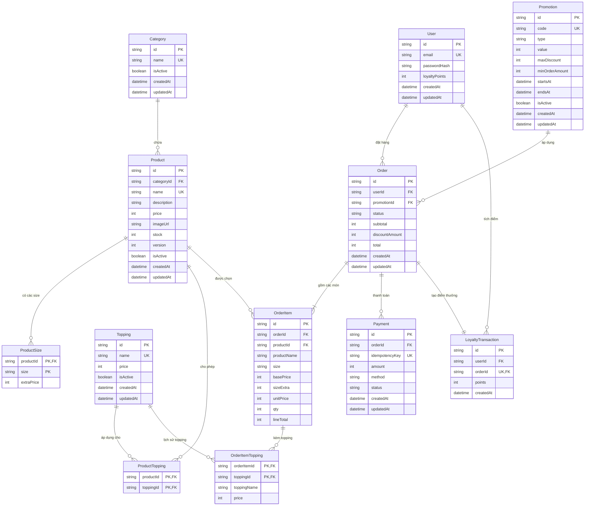

# Thiết kế CSDL & Sơ đồ ERD – Dự án BrewLite

> **Tài liệu bàn giao Sub-task 11.1 (PB-11) – Sprint 1**  
> **Người thực hiện:** M2 (Software Architect / Tech Lead)  
> **Định dạng nguồn:** [`docs/erd/erd.dbml`](./erd.dbml) (sử dụng được trên [dbdocs.io](https://dbdocs.io) hoặc [dbdiagram.io](https://dbdiagram.io))  
> **Sơ đồ xuất PDF:** [`docs/erd/ERD.pdf`](./ERD.pdf)  
> **Hệ quản trị CSDL mục tiêu:** PostgreSQL 16+

---

## 1. Sơ đồ thực thể quan hệ (ERD - Mermaid)

---

## 2. Quy ước đặt tên (Naming Conventions)

Để đảm bảo tính nhất quán giữa CSDL PostgreSQL, Prisma ORM và mã nguồn NestJS/TypeScript:

| Đối tượng | Quy ước trong Prisma / Code | Quy ước trong PostgreSQL (Database) | Ví dụ |
| :--- | :--- | :--- | :--- |
| **Bảng (Table)** | `PascalCase`, danh từ số ít | `snake_case`, danh từ số nhiều (thông qua `@@map`) hoặc giữ nguyên PascalCase | `Product` $\leftrightarrow$ `products` |
| **Cột (Column)** | `camelCase` | `snake_case` (thông qua `@map`) | `createdAt` $\leftrightarrow$ `created_at` |
| **Khóa chính (PK)** | `id` | `id` kiểu chuỗi (`cuid()` hoặc `uuid()`) | `id String @id @default(cuid())` |
| **Khóa ngoại (FK)** | `<entity>Id` | `<entity>_id` | `categoryId` $\leftrightarrow$ `category_id` |
| **Bảng nối (Junction)** | Ghép tên 2 thực thể theo `PascalCase` | Ghép tên 2 thực thể theo `snake_case` | `ProductTopping`, `ProductSize` |
| **Tiền tệ (Currency)** | `Int` (VND) | `INTEGER` hoặc `BIGINT` | `price`, `total` (số nguyên, không thập phân) |
| **Thời gian (Timestamp)**| `DateTime` | `TIMESTAMPTZ` / `TIMESTAMP` | `createdAt`, `updatedAt` |
| **Enum** | `PascalCase` cho tên, `UPPER_SNAKE_CASE` cho giá trị | `ENUM` | `OrderStatus.PENDING`, `PaymentMethod.WALLET` |

---

## 3. Phân rã phạm vi theo từng Sprint

### 📌 Sprint 1 – Nền tảng & Hiển thị Menu (Trọng tâm hiện tại)
* `Category`: Phân loại đồ uống (Cà phê, Trà, Đá xay,...).
* `Product`: Thông tin sản phẩm cốt lõi (tên, giá gốc size S, ảnh, tồn kho ban đầu).
* `ProductSize`: Cấu hình các size khả dụng (S, M, L) và phụ thu tương ứng (+0đ, +5.000đ, +10.000đ).
* `Topping`: Danh mục topping dùng chung (Trân châu, Kem cheese, Thạch,...).
* `ProductTopping`: Ràng buộc món nào được phép chọn topping nào.

### 📌 Sprint 2 – Tài khoản & Đặt đơn
* `User`: Khách hàng (email, mật khẩu băm bcrypt, điểm tích lũy).
* `Order`: Đơn hàng (trạng thái, tổng tiền tạm tính, số tiền giảm, tổng thanh toán).
* `OrderItem`: Chi tiết món trong đơn kèm giá snapshot tại thời điểm đặt.
* `OrderItemTopping`: Chi tiết topping được chọn cho từng món kèm giá snapshot.

### 📌 Sprint 3 – Thanh toán, Nghiệp vụ nâng cao & Bàn giao
* `Payment`: Giao dịch thanh toán với `idempotencyKey` để chống trừ tiền/tạo giao dịch lặp.
* `Promotion`: Quản lý voucher / mã giảm giá (giảm cố định VND hoặc theo %).
* `LoyaltyTransaction`: Ghi nhận lịch sử cộng điểm sau khi đơn hàng thanh toán thành công (`PAID`).

---

## 4. Quyết định kiến trúc & Thiết kế cốt lõi (ADR)

1. **Snapshot Pattern cho Đơn hàng (`OrderItem`, `OrderItemTopping`):**
   * *Vấn đề:* Sau này chủ quán có thể tăng giá cà phê, sửa tên món, hoặc xóa topping khỏi menu.
   * *Giải pháp:* Lưu trực tiếp `productName`, `basePrice`, `sizeExtra`, `toppingName`, `price` vào `OrderItem` và `OrderItemTopping`.
   * *Lợi ích:* Đơn hàng cũ trong lịch sử không bao giờ bị sai lệch số liệu khi menu thay đổi. Không phụ thuộc ràng buộc Foreign Key cứng vào bảng cấu hình menu.

2. **Khóa chính phức hợp (Composite PK) cho bảng nối:**
   * `ProductSize(productId, size)` và `ProductTopping(productId, toppingId)` dùng khóa chính kép.
   * Ngăn chặn hoàn toàn việc lưu trùng lặp một size hoặc một topping cho cùng một món.

3. **Cơ chế Khóa Lạc Quan (Optimistic Locking) cho Tồn kho:**
   * Trường `version` trong bảng `Product` được thiết kế để phục vụ **Task 10.3 (Sprint 3)**:
     Khi nhiều khách đặt món đồng thời, cập nhật tồn kho dựa trên câu lệnh:
     `UPDATE products SET stock = stock - qty, version = version + 1 WHERE id = :id AND version = :version AND stock >= qty`
   * Tránh tình trạng over-selling mà không gây nghẽn database.

4. **Chống thanh toán trùng lặp (Idempotency):**
   * Trường `idempotencyKey` trong bảng `Payment` có chỉ mục `UNIQUE` bắt buộc, đáp ứng **Task 10.2 (Sprint 3)**.

---
*Tài liệu được chuẩn bị bởi **M2** sẵn sàng bàn giao cho **M3** tiến hành viết file `schema.prisma` và khởi tạo migration đầu tiên (Sub-task 11.2).*
